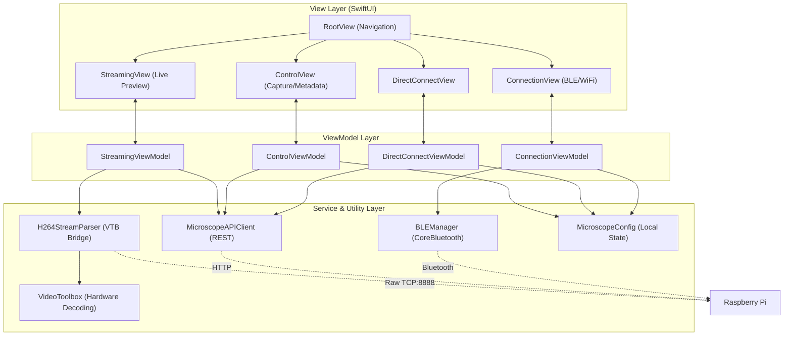

# opendihm-mobile-ios
The iOS client-application for using OpenDIHM project. The application is a simple UI for controlling the microscope.
It is built using SwiftUI and Swift. It starts the communication with the firmware via Bluetooth and shares the WiFi
connection with the firmware. After the connection is established, the application displays the video stream from the
firmware and provides controls for the microscope. The controls are provided via HTTP API with basic authentication.

## Features
- UI for WiFi connection sharing via Bluetooth
- UI for microscope control
   - Laser control (on/off via relay)
   - Camera control (zoom (3-levels), v4l2 controls)
- UI for video stream display over RTSP
- UI for authentication of the user
- UI for logging out the user
- UI for configuration of the microscope
- UI for updating the configuration of the microscope
- UI for server status
- UI for server logs

## Connection Flow
- The Raspberry Pi boots up and broadcasts a Bluetooth Low Energy (BLE) signal.
- The iOS app connects to the Pi via Bluetooth.
- The iOS app securely sends the current Wi-Fi network's SSID and password over Bluetooth to the Pi.
- The iOS app displays the video stream from the Raspberry Pi over RTSP.

## Platform
- iOS 26.0
- Xcode 26.0
- Swift 6.2

## Project Architecture
